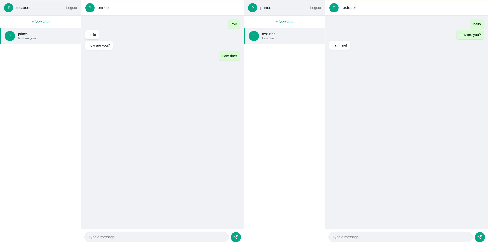

# WhatsApp Clone

A full-stack, real-time chat application built with the MERN stack, inspired by WhatsApp Web. Supports live messaging, typing indicators, online presence, user search, and per-user chat deletion — all built from scratch without a boilerplate.

🔗 **Live Demo:** [whatsapp-clone-jade-alpha.vercel.app](https://whatsapp-clone-jade-alpha.vercel.app)

> Note: the backend is hosted on Render's free tier, which spins down after inactivity. The first request after idling may take 30–50 seconds to respond.

## Screenshot



## Features

- **Authentication** — JWT-based auth with short-lived access tokens and long-lived refresh tokens stored in httpOnly cookies, including silent session restoration on page reload
- **Real-time messaging** — instant message delivery via Socket.io, mapped per logged-in user, not broadcast globally
- **Typing indicators** — live "user is typing..." events over sockets
- **Online presence** — tracks and broadcasts which users are currently connected
- **User search** — find and start conversations with any registered user by username
- **Duplicate-safe conversations** — prevents creating multiple conversation threads between the same two users
- **Per-user chat deletion** — deleting a chat hides it (and its message history up to that point) only for you; it reappears automatically, showing only new messages, if the other person messages you again
- **Responsive design** — adapts from a two-panel desktop layout to a single-view, stack-based navigation pattern on mobile

## Tech Stack

**Frontend:** React, Vite, React Router, Tailwind CSS, Axios, Socket.io-client

**Backend:** Node.js, Express, MongoDB (Mongoose), Socket.io, JWT, bcrypt

**Deployment:** Vercel (frontend), Render (backend), MongoDB Atlas (database)

## Architecture Highlights

A few technical decisions worth noting:

- **Access + refresh token split** — access tokens expire in 15 minutes to limit the damage window if one is ever leaked; a refresh token in an httpOnly cookie (invisible to JavaScript, protecting against XSS) silently issues new access tokens in the background, keeping the user logged in for up to 7 days without repeated logins.
- **Socket-to-user mapping** — each connected client's `userId` is mapped to its live `socket.id` in memory on the server, so messages can be pushed to a specific user's active connection rather than broadcast to everyone.
- **Timestamp-based deletion** — rather than a simple boolean flag, chat deletion stores a per-user timestamp. When fetching message history, only messages sent after that timestamp are returned for that user — meaning a "deleted" chat that becomes active again doesn't leak old history back to the person who deleted it.
- **Production race condition** — a subtle bug surfaced only in production (not localhost): a component could fetch data before the auth token was ready, due to network latency during token refresh. Fixed using a `useRef` to always read the latest token value at request-time, independent of React's effect ordering.

## Running Locally

### Prerequisites
- Node.js
- A MongoDB Atlas account (or local MongoDB instance)

### Setup

1. Clone the repo
```bash
   git clone https://github.com/Aayush2061/whatsapp-clone.git
   cd whatsapp-clone
```

2. **Backend setup**
```bash
   cd server
   npm install
```
   Create a `.env` file in `server/`:

```
PORT=5000
MONGO_URI=your_mongodb_connection_string
JWT_SECRET=your_random_secret
JWT_REFRESH_SECRET=your_random_refresh_secret
```

   Run the server:
```bash
   node src/index.js
```

3. **Frontend setup**
```bash
   cd ../client
   npm install
```
   Create a `.env` file in `client/`:

  ```
VITE_API_URL=http://localhost:5000
```

      Run the frontend:
```bash
   npm run dev
```

4. Visit `http://localhost:5173`

## Author

Built by [Aayush Bhandari](https://github.com/Aayush2061)